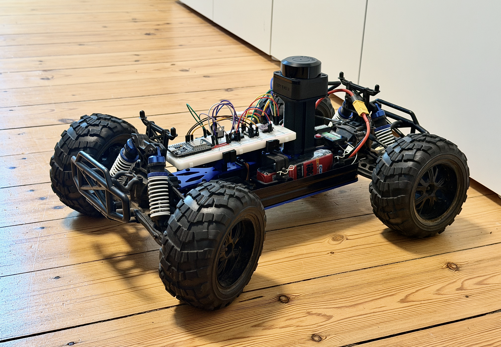
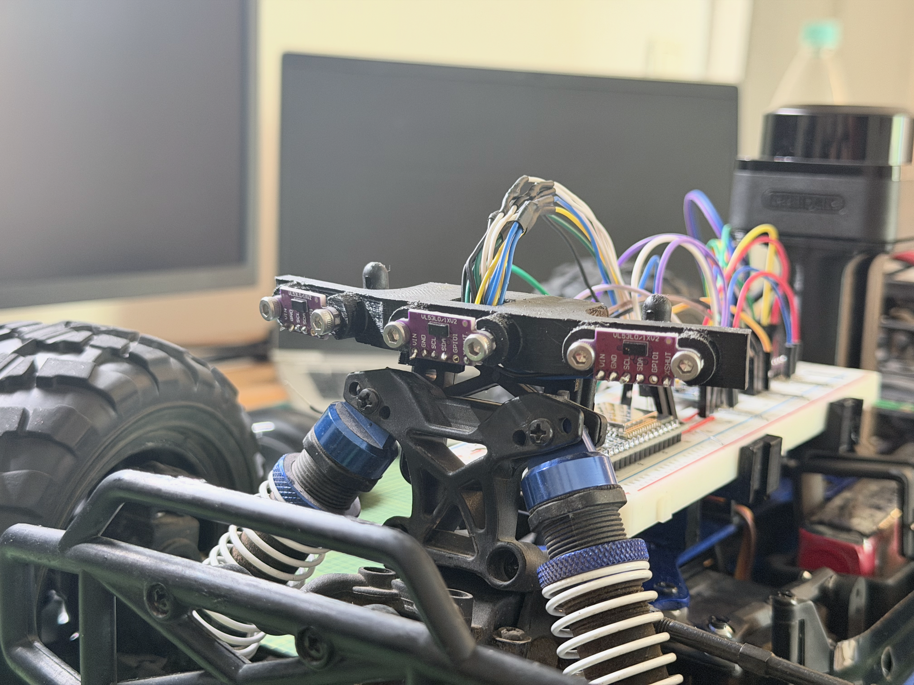
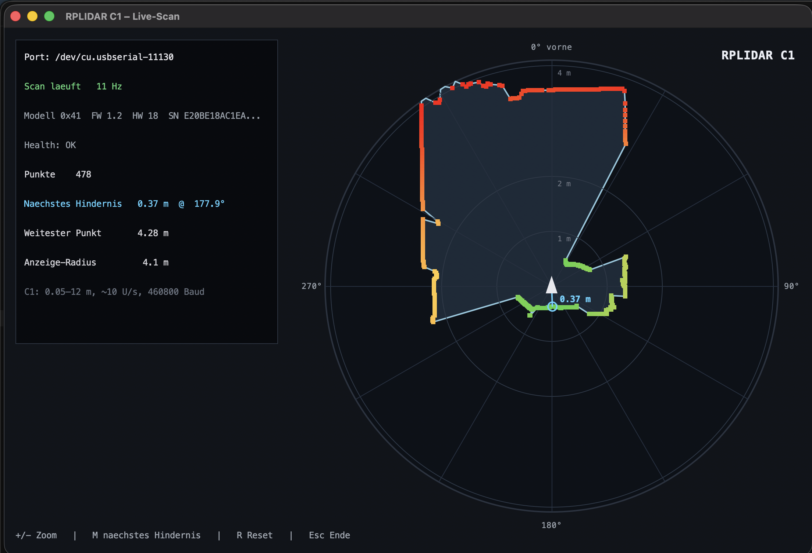
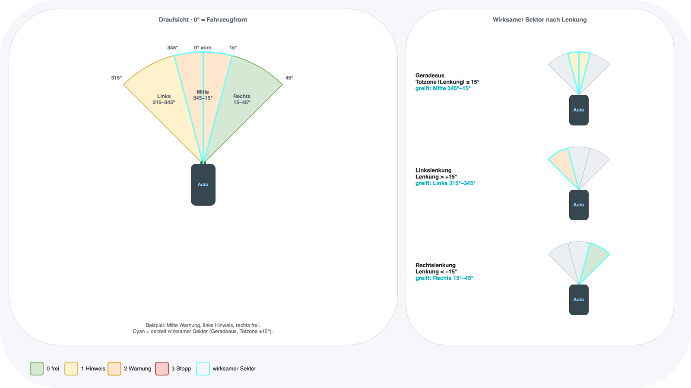
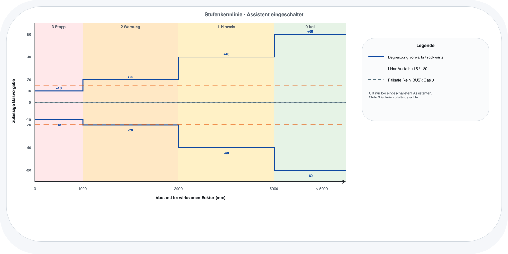
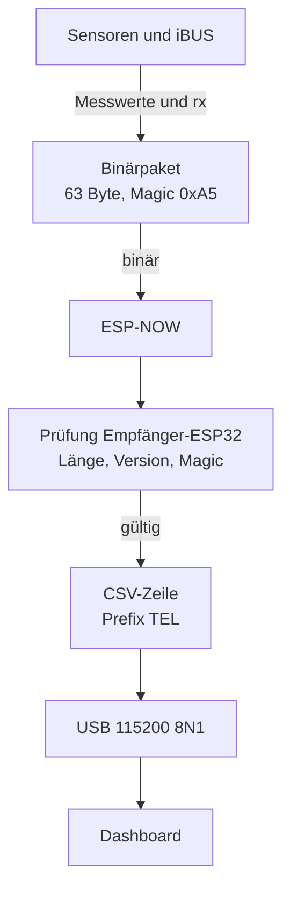
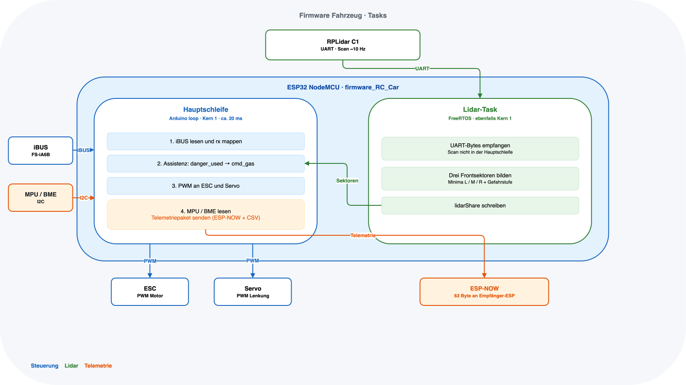

# Projekt RC-Auto mit Notbremsassistent

## Inhaltsverzeichnis

1. [Projektziel](#1-projektziel)
2. [Systemüberblick](#2-systemüberblick)
3. [Hardware](#3-hardware)
4. [Notbremsassistent](#4-notbremsassistent)
5. [Telemetrie](#5-telemetrie)
6. [Software](#6-software)
7. [Stand, Grenzen, Ausblick](#7-stand-grenzen-ausblick)

---

## 1. Projektziel

Ziel des Projektes ist es, einen Notbremsassistenten für ein RC-Auto zu entwickeln. Daraus ergeben sich folgende Teilziele:

1. Das RC-Auto wird über eine Funkfernsteuerung gesteuert.
2. Das Fahrzeug soll über Abstandssensoren Hindernisse in der Umgebung erkennen.
3. Wird ein Hindernis erkannt, soll in die Ansteuerung des Motors eingegriffen werden, um das Fahrzeug zu verlangsamen und eine Kollision zu vermeiden.
4. Zur Überwachung des Fahrzeugs ist eine Übertragung der Telemetriedaten auf einen Mac zu realisieren. Die Daten sollen dort übersichtlich in einem Dashboard dargestellt werden.
5. Im Rahmen des Projektes ist zu evaluieren, welcher Mikrocontroller und welche Sensoren auf dem Fahrzeug für diesen Zweck genutzt werden können.

---

## 2. Systemüberblick

Das System umfasst das RC-Auto, einen zweiten ESP32 als Brücke zum Rechner und ein Dashboard auf dem Mac. Die Funkfernsteuerung bleibt die primäre Bedienung des Fahrzeugs. Der Mikrocontroller auf dem Auto wird zwischen den FlySky-Empfänger sowie ESC und Servo geschaltet. Die Steuerbefehle liegen am Empfänger als iBUS-Signal an. Der ESP32 wertet sie aus und gibt PWM-Signale an Motorregler und Lenkservo weiter.

Zur Erkennung von Hindernissen ist ein RPLidar C1 auf dem Fahrzeug montiert. Erkennt die Firmware ein Objekt in Fahrtrichtung, wird in die Gasvorgabe eingegriffen und das Fahrzeug verlangsamt. Über einen Schalter an der Fernsteuerung kann dieser Eingriff ein- und ausgeschaltet werden. Ein MPU6050 und ein BME280 erfassen zusätzlich Bewegungs- und Umgebungsdaten. Diese Werte dienen der Überwachung und werden mit der Telemetrie übertragen, sie fließen jedoch nicht in die Notbremslogik ein.

Zur Überwachung wird eine Telemetrieverbindung aufgebaut. Die am Fahrzeug anfallenden Daten werden per ESP-NOW an den zweiten ESP32 gesendet. Dieser ist per USB mit dem Mac verbunden und gibt die Pakete über die serielle Schnittstelle aus. Das Dashboard stellt die Telemetrie live dar.

---

## 3. Hardware

Nachfolgend wird die im Projekt verwendete Hardware beschrieben.

### 3.1 Fahrzeug und Antrieb

### 3.2 Stückliste

| Komponente      | Typ                                       |
| --------------- | ----------------------------------------- |
| Auto            | Mali Racing BigHammer 2                   |
| Motor           | QweenHobby 3670-2650KV                    |
| ESC             | Hobbywing QuicRun WP 10BL120 G2 120A      |
| Servo           | B7018 9kg                                 |
| Empfänger       | FlySky FS-iA6B                            |
| Steuerung       | FlySky FS-i6X                             |
| Akku            | Conrad Energy 3S 25C (1800 mAh, 11,1 V)   |
| Mikrocontroller | 2× ESP32 NodeMCU (Fahrzeug und Empfänger) |
| Umfeldsensor    | Slamtec RPLidar C1                        |
| IMU             | MPU6050 (Beschleunigung und Gyroskop)     |
| Umweltsensor    | BME280 (Druck, Temperatur, Luftfeuchte)   |
| Zubehör         | Logic-Level-Shifter                       |
|                 | TS7805 (Spannungsregler 5 V)              |

### 3.3 Schaltplan und Verdrahtung

Das Fahrzeug ist gemäß dem Schaltplan aufgebaut. Der Schaltplan wird in KiCad gezeichnet. Die folgende Belegung entspricht der Firmware und ist die Vorgabe für den Plan.

| Signal        | ESP32          | Gegenstelle              | Hinweis                                      |
| ------------- | -------------- | ------------------------ | -------------------------------------------- |
| Lidar RX      | GPIO 16        | RPLidar TX               | UART2, 460800 8N1                            |
| Lidar TX      | GPIO 17        | RPLidar RX               | UART2                                        |
| iBUS RX       | GPIO 34        | FlySky FS-iA6B iBUS      | nur Eingang, 115200 8N1                      |
| Motor PWM     | GPIO 33        | ESC Signal               | 50 Hz, 1000–2000 µs                          |
| Servo PWM     | GPIO 32        | Lenkservo                | 50 Hz, 1000–2000 µs                          |
| SDA           | GPIO 21        | MPU6050, BME280          | I²C 400 kHz                                  |
| SCL           | GPIO 22        | MPU6050, BME280          | gemeinsam mit SDA                            |
| Lidar-Versorgung | TS7805 5 V  | RPLidar VCC              | UART-Pegel 3,3 V, nicht 5 V                  |
| ESP32-Logik   | 3,3 V          | MPU, BME, UART           | ESP32-Pins sind nicht 5-V-tolerant           |
| Masse         | GND            | alle Baugruppen          | gemeinsame Masse mit Akku/ESC                |

Der RPLidar C1 braucht 5 V Versorgung, die UART-Leitungen sind 3,3 V. Ein Level-Shifter ist auf den Datenleitungen nur nötig, wenn 5-V-Pegel anliegen; gegenüber dem ESP32 dürfen keine 5 V auf RX/TX oder iBUS liegen. GPIO 34 kann ausschließlich lesen, deshalb liegt iBUS nur dort als Empfang. ESC und Servo werten das 3,3-V-PWM des ESP32 in der Regel direkt.

> **Abbildung 3 (Platzhalter):** KiCad-Schaltplan mit Spannungsversorgung (3S-Akku, TS7805), ESP32, iBUS, ESC, Servo, Lidar (UART) sowie I²C (MPU6050, BME280).

### 3.4 Auswahl Mikrocontroller (ESP32 vs. Arduino Nano)

Zunächst wurde dieses Projekt mit einem Arduino Nano begonnen. Dieser stieß relativ schnell an seine Grenzen, da unter anderem drei native UARTs (iBUS, Lidar, Debug-Ausgabe) benötigt wurden. Daher wurde als Alternative der ESP32 getestet. Dieser verfügt zudem über die Funktechnik ESP-NOW, die für die Übertragung der Telemetriedaten sehr hilfreich war. Dadurch konnte auf den Einsatz eines zusätzlichen Funkmoduls verzichtet werden. Aus diesen Gründen wurde der Arduino Nano durch den ESP32 ersetzt.

| Kriterium              | Arduino Nano      | ESP32                          |
| ---------------------- | ----------------- | ------------------------------ |
| Native UARTs           | 1                 | 3 (iBUS, Lidar, Debug-Ausgabe) |
| Funk (ESP-NOW)         | nicht vorhanden   | integriert                     |
| Zusätzliches Funkmodul | erforderlich      | nicht erforderlich             |

### 3.5 Auswahl Abstandssensor (RPLidar C1 vs. VL53L0X)

Im Laufe des Projektes wurde zunächst eine Kombination aus drei VL53L0X-Abstandssensoren getestet, da diese aus wirtschaftlichen Gründen zu bevorzugen war. Dabei wurden drei dieser Sensoren an der Front des Fahrzeugs über ein 3D-Druckteil montiert. Ein Sensor war direkt nach vorne ausgerichtet, die beiden anderen mit je 15° Neigung nach rechts und links. Im Rahmen der Evaluation wurde jedoch festgestellt, dass die Reichweite, in der Objekte sicher erkannt werden, maximal 1 m beträgt. Für die Geschwindigkeit, mit der sich das Fahrzeug bewegt, ist dieser Abstand deutlich zu gering.

Als Alternative wurde ein RPLidar C1 evaluiert. Der Sensor erstellt einen 360°-Scan der Umgebung mit einer Messreichweite von maximal 12 m. Die Datenmenge, die dieser Sensor liefert, ist für einen Mikrocontroller sehr hoch, daher werden nur drei Frontsektoren (links 315–345°, Mitte 345–15°, rechts 15–45°) genutzt.

Aufgrund der gesammelten Daten wurde der Einsatz des RPLidar C1 beschlossen.

---

## 4. Notbremsassistent

Der Notbremsassistent sitzt in der Firmware des fahrzeugseitigen ESP32. Die Funkfernsteuerung bleibt die primäre Vorgabe. Der Assistent begrenzt lediglich die Gaswerte, die an den ESC weitergegeben werden. Die Lenkung wird unverändert durchgereicht.

Über einen Schalter an der Fernsteuerung (iBUS-Kanal 5) kann zwischen zwei Betriebsarten gewechselt werden. Ist der Assistent ausgeschaltet, werden die Empfängerwerte unverändert an ESC und Servo gegeben. Ist er eingeschaltet, wird die Gasvorgabe anhand der Lidar-Daten begrenzt.

Der RPLidar C1 liefert einen 360°-Scan. Für die Assistenz werden nur drei Frontsektoren ausgewertet (links 315–345°, Mitte 345–15°, rechts 15–45°). Je Sektor zählt die kleinste gültige Distanz in Millimetern. Daraus entsteht eine Gefahrenstufe. Welche Stufe tatsächlich greift, hängt von der Lenkung ab: Innerhalb einer Totzone von ±15° gilt der mittlere Sektor, außerhalb der Totzone der Sektor in Lenkrichtung.

| Stufe | Bedeutung | Abstand             | Begrenzung der Gasvorgabe |
| ----- | --------- | ------------------- | ------------------------- |
| 0     | frei      | größer als 5000 mm  | ±60                       |
| 1     | Hinweis   | 3000–5000 mm        | ±40                       |
| 2     | Warnung   | 1000–3000 mm        | ±20                       |
| 3     | Stopp     | kleiner als 1000 mm | +10 / −15                 |

Die Gasvorgabe liegt im Bereich −100 bis 100. Auch bei freier Strecke bleibt eine Obergrenze von ±60 bestehen, solange der Assistent eingeschaltet ist. Stufe 3 ist kein vollständiger Halt: Es verbleibt ein geringer Vorwärts- und Rückwärtsanteil, damit das Fahrzeug nicht unkontrolliert stehen bleibt und weiterhin rangiert werden kann. Die Abstandsschwellen sind ein erster Arbeitspunkt und können später an das Fahrverhalten angepasst werden.

Fällt der Lidar aus oder liefert keinen gültigen Scan, wird die Gasvorgabe vorsorglich auf +15 / −20 begrenzt. Bleibt das iBUS-Signal länger als 100 ms aus, gilt Failsafe: Das Gas wird auf 0 gesetzt, die letzte Lenkstellung bleibt erhalten.

---

## 5. Telemetrie

Ziel der Telemetrie ist es, den Zustand des Fahrzeugs auf dem Mac nachvollziehbar zu machen. Dazu gehören die Vorgabe der Fernsteuerung, die tatsächlich ausgegebenen Stellgrößen, die Lidar-Sektoren samt Gefahrenstufen sowie die Messwerte von MPU6050 und BME280.

Die Übertragung erfolgt in zwei Schritten. Auf dem Fahrzeug werden die Daten in einem fest gepackten Binärpaket (Version 1, 63 Byte) zusammengestellt und per ESP-NOW an den zweiten ESP32 gesendet. Dieser prüft Länge, Versionsnummer und ein festes Erkennungsbyte am Paketanfang. Gültige Pakete werden in eine CSV-Zeile mit dem Prefix `TEL` umgewandelt und über USB (115200 8N1) an den Mac ausgegeben. Das Dashboard stellt diese Zeilen live dar und kann sie aufzeichnen.

**Abbildung 9:** Datenfluss der Telemetrie vom Fahrzeug zum Dashboard.

Es werden bewusst nicht alle Lidar-Punkte übertragen. Eine vollständige Punktewolke würde das ESP-NOW-Limit von 250 Byte überschreiten. Stattdessen gehen nur die drei Sektorminima und die zugehörigen Gefahrenstufen ins Paket. Die Felder `rx` beschreiben den Wunsch der Fernsteuerung, die Felder `cmd` das, was Motor und Servo wirklich erhalten. Dadurch sind Eingriffe des Assistenten im Dashboard erkennbar. Eine laufende Sequenznummer und die Fahrzeugzeit in Millisekunden erlauben es, Verluste und die zeitliche Abfolge zu erkennen.

Die Pakete werden etwa alle 20 ms erzeugt. Der Lidar liefert neue Sektorwerte nur mit seiner Umlaufzeit; dazwischen werden die letzten gültigen Distanzen gehalten. Ungültige Sensorwerte werden auf 0 gesetzt und über Flags gekennzeichnet, unter anderem für MPU, BME, Lidar, Failsafe und einen aktiven Eingriff des Assistenten. Die Akkuspannung ist im Datenformat vorgesehen, im aktuellen Stand aber noch nicht angebunden. Die genaue Feldliste des Pakets ist in [`Note.md`](Note.md) beschrieben.

---

## 6. Software

Die einzelnen zu entwickelnden Funktionen wurden im Rahmen von diversen Prototypen getestet und am Ende zu einem gemeinsamen Stand für Fahrzeug und Empfänger zusammengeführt. Die Prototypen liegen im Ordner `prototyps/` und behandeln unter anderem iBUS, ESP-NOW, den MPU6050 und die Lidar-Auswertung. Die integrierte Software gliedert sich in drei Teile.

### 6.1 Firmware Fahrzeug

Die Firmware des Fahrzeugs liegt im Ordner `firmware_RC_Car` und wird mit PlatformIO für den ESP32 im Arduino-Framework gebaut. Sie vereint die zuvor getrennt erprobten Funktionen in einem Programm: das Auslesen des iBUS-Signals, die Ansteuerung von ESC und Servo per PWM, die Auswertung des RPLidar C1, das Einlesen von MPU6050 und BME280 sowie das Versenden der Telemetrie per ESP-NOW.

Die Lidar-Auswertung läuft in einem eigenen FreeRTOS-Task (`lidarTask`), nicht in der Arduino-`loop()`. Der Task ist auf Kern 1 gepinnt. Beim ESP32 mit Arduino-Framework läuft `loop()` standardmäßig ebenfalls auf Kern 1; Kern 0 bedient den WLAN-/ESP-NOW-Stack. Hauptschleife und Lidar-Task teilen sich damit denselben Kern. Der Lidar-Task hat die höhere Priorität (3 gegenüber 1) und gibt mit `vTaskDelay` regelmäßig ab, damit iBUS, PWM und Telemetrie weiterlaufen. Eine echte Verteilung auf zwei Anwendungskerne wäre erst gegeben, wenn der Lidar-Task auf Kern 0 läge.

In der Hauptschleife wird etwa alle 20 ms das iBUS-Signal ausgewertet, die Assistenzlogik angewendet und ein Telemetriepaket erzeugt. Parallel dazu schreibt die Firmware dieselbe CSV-Zeile auf die serielle Debug-Schnittstelle. Die Logik des Notbremsassistenten ist in Kapitel 4 beschrieben.

### 6.2 Firmware Empfänger

Die Empfänger-Firmware liegt im Ordner `firmware_Reciver`. Sie enthält keine Fahrlogik. Ihre einzige Aufgabe ist es, ESP-NOW-Pakete entgegenzunehmen, auf Länge, Versionsnummer und Erkennungsbyte zu prüfen und gültige Datensätze als CSV-Zeile über USB auszugeben. Ungültige oder unvollständige Pakete werden verworfen. Dadurch bleibt der Mac von der binären Funkstrecke entkoppelt; das Dashboard spricht nur die serielle Schnittstelle an.

### 6.3 Dashboard

Das Dashboard ist eine Python-Anwendung auf Basis von PySide6 und liegt im Ordner `Dashboard`. Es liest die CSV-Zeilen vom Empfänger-ESP32 und stellt den Fahrzeugzustand live dar. Eine Draufsicht zeigt das Auto mit Lenkeinschlag und den drei Lidar-Sektoren in der Farbe der jeweiligen Gefahrenstufe. Daneben wird die Lage im Raum aus den IMU-Daten angenähert. Werte von Fernsteuerung und Assistent (`rx` gegenüber `cmd`) sowie Flags für Sensorausfall, Failsafe und Eingriffe erscheinen in einer Seitenleiste.

Die Gefahrenstufen werden nicht neu berechnet, sondern unverändert aus dem Telemetriepaket übernommen. Zusätzlich können Live-Daten als CSV aufgezeichnet und später mit dem ursprünglichen Zeitverlauf abgespielt werden. Start und Bedienung sind in [`Dashboard/README.md`](Dashboard/README.md) beschrieben.

*Hinweis: Das Dashboard wurde vollständig über KI-Agenten erstellt.*

---

## 7. Stand, Grenzen, Ausblick

### 7.1 Stand

Die in Kapitel 1 genannten Teilziele sind im Wesentlichen umgesetzt. Das RC-Auto wird über die vorhandene Funkfernsteuerung gefahren. Der ESP32 sitzt zwischen Empfänger, ESC und Servo. Hindernisse werden mit dem RPLidar C1 in drei Frontsektoren erkannt, die Gasvorgabe kann stufenweise begrenzt und der Assistent an der Fernsteuerung ein- und ausgeschaltet werden. Mikrocontroller und Abstandssensor wurden evaluiert und begründet ausgewählt. Die Telemetrie erreicht den Mac, das Dashboard stellt die Werte live dar und kann Fahrten aufzeichnen.

### 7.2 Grenzen

Die entscheidende Grenze liegt in der Art des Eingriffs. Es wird nur die Gasvorgabe an den ESC verändert, nicht die tatsächliche Geschwindigkeit. Wird das Gas reduziert, bremst das Fahrzeug nicht unmittelbar ab, sondern rollt mit der vorhandenen kinetischen Energie weiter. Stufe 3 ist zudem kein Halt, und die Abstandsschwellen sind noch nicht an den realen Anhalteweg angepasst. Auf dieser Grundlage können Kollisionen derzeit nicht zuverlässig verhindert werden. Weitere Einschränkungen folgen daraus: Seitliche und hintere Bereiche des Lidar-Scans fließen nicht in die Assistenz ein, und die Akkuspannung ist im Datenformat vorgesehen, aber noch nicht gemessen.

### 7.3 Ausblick

Ein nächster Schritt wäre, die Fahrgeschwindigkeit zu messen und die Ansteuerung über einen PID-Regelkreis zu führen. Die Gefahrenstufe würde dann eine Zielgeschwindigkeit vorgeben, nicht nur eine Drosselung des Sticks. Erst damit ließe sich das Fahrzeug nach einer Reduktion wirklich verzögern, statt es ausrollen zu lassen. Ergänzend sollten die Abstandsschwellen am Fahrzeug kalibriert und die Akkuspannung in die Telemetrie übernommen werden.
